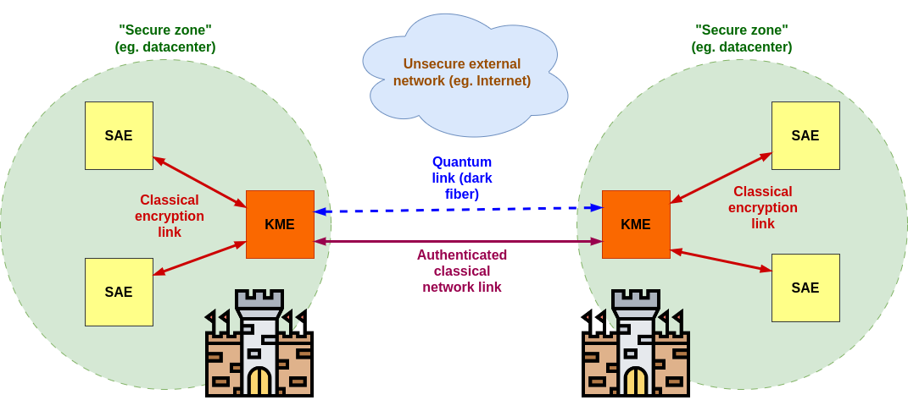
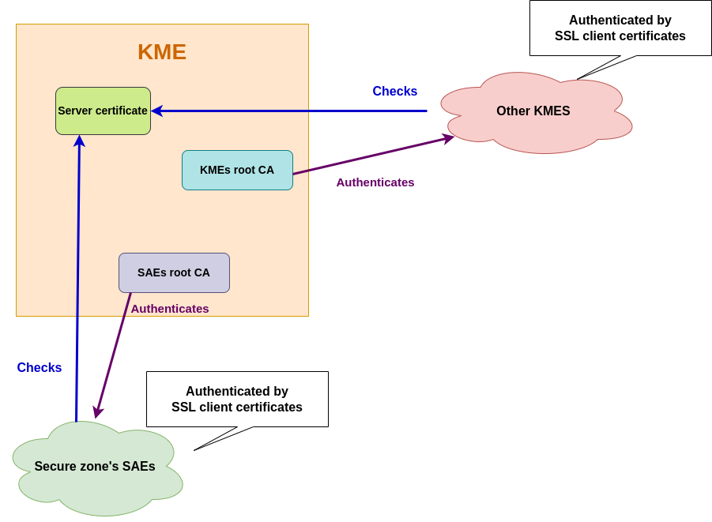

# ETSI-compliant Quantum Key Distribution (QKD) Key Management Entity server

*The following repository contains an implementation proposal for the KME (Key Management Entity) server defined in the [ETSI QKD standard](docs/etsi_qkd_standard_definition.pdf) for Quantum Key Distribution.*

---

## Introduction

### Quantum Key Distribution

Cross-datacenter communication is a common use case in the cloud.
It is often necessary to encrypt data in transit between datacenters, and this encryption almost always involves public key cryptography.

However, currently used public key cipher suites, such as RSA or ECC are not quantum-safe, and it is expected that quantum computers will be able to break them in the future.

There are public key cipher suites that are quantum-safe, such as the ones based on lattice cryptography, but they are not yet widely used. Furthermore, no one can be sure that they will never be broken in the future.
So public key cryptography is not a good solution for guaranteed forward secrecy.

On the other hand, Quantum Key Distribution (QKD) is a mechanism that allows two parties to produce a shared random secret key, which can be used to encrypt and decrypt messages, and which guarantees theoretical forward secrecy.

Indeed, QKD is based on the laws of quantum physics, and it is theoretically impossible to eavesdrop on a QKD key exchange without being detected. The only condition is that the two parties have correctly authenticated each other beforehand.

### ETSI QKD standard for production environments

The [ETSI standard](docs/etsi_qkd_standard_definition.pdf) defines a protocol for usage of quantum-distributed keys by applications.

It assumes the existence of "secure-zones", meaning zones protected against cyber and physical intrusions. It is possible to assume traditional public-key cryptography is secure in these zones.
These zones can be, for example, datacenters.

On the other hand, communications between "secure-zones" as to be secured using QKD.

Standard defines the following entities:
- **Key Management Entity (KME)**: responsible for managing the keys exchanged between the secure zones and furnishing them to Secure Application Entities (SAEs).
- **Secure Application Entity (SAE)**: Exchange keys with other SAEs.

.

### Software description

This software intends to manage QKD-exchanged key, in a way compliant with the ETSI standard.

This software has to be run in the KME servers. One KME can support multiple remote KMEs connections.
For compatibility purpose, it also supports key exchange between KMEs in the same zone (for which direct public-key encryption is enough).

There should exist a directory where binary key files are stored after Privacy Amplification. **These files have to be named equally on both KMEs.**

:point_right: **Note:** QKD can be performed while this software is running, it will simply detect new key files in the directory.

All the authentication is performed via SSL client and server certificates. Within the same "secure-zone", SAEs are distinguished by their client certificate serial number.

For now read QKD keys are stored inside a SQLite database, either in memory or on disk.

:checkered_flag: I plan to add a feature to store keys in a secure database in the future.

---

## Getting started

### Supported platforms

- :white_check_mark: : Guaranteed to work, as the tests are run on this platform.
- :negative_squared_cross_mark: Tested regularly, but not guaranteed to work.
- :interrobang: Should work, but not tested.

| Platform                       | Status                        |
|--------------------------------|-------------------------------|
| Linux Ubuntu 24.04 x86_64      | :white_check_mark:            |
| Windows Server 2022 x86_64     | :white_check_mark:            |
| MacOS 14 arm64                 | :white_check_mark:            |
| Windows 11 Professional x86_64 | :negative_squared_cross_mark: |
| FreeBSD 14 x86_64              | :negative_squared_cross_mark: |
| All other computer platforms   | :interrobang:                 |


**Note:** On MacOS, you need to use `pem` certificates instead of `pfx` certificates, as explained below.

If you encounter any issue on a platform, please check the [TROUBLESHOOTING.md](TROUBLESHOOTING.md) file. If you still have an issue, please open an issue on GitHub.

### Compilation

Install Rust programming language, as explained at https://www.rust-lang.org/tools/install.

```bash
git clone https://github.com/thomasarmel/qkd_kme_server.git
cd qkd_kme_server
cargo test
cargo build --release
```

It has been tested for both Linux and Windows.

### Tests:

You run unit tests with:

```bash
cargo test
```

For a simple proof of concept in local, you can run the software with 
`config_kme1.json5` and `config_kme2.json5` files as argument for 
respectively KME1 and KME2.

For local tests, certificates are pre-generated and stored in the `certs` folder.

### Running

#### QKD key directory

First of all, please ensure there is a directory in both KMEs where the QKD keys are stored.
Files should have the same name and contents in both KMEs. They should have the `.cor` extension. :red_circle: These must be the files generated **AFTER** Privacy Amplification. :red_circle:

This software will detect new files automatically in case you are doing QKD on-the-fly.

#### Generating certificates

You must generate SSL certificates for both SAE-to-KME and KME-to-KME communications (in the latter certificates are used only for authentication).

Here is an example of how to quickly generate all SSL certificates.
If your adversary already has access to an efficient quantum computer (I don't know when you are reading this), you can use [Open Quantum Safe OpenSSL fork](https://openquantumsafe.org/applications/tls.html) to generate your certificates.

**KMEs' server certificates:**

For all KMEs, you can generate a self-signed certificate with:

```bash
openssl genrsa -out kme_server.key 4096
openssl req -new -key kme_server.key -out kme_server.csr
openssl x509 -req -days 3650 -in kme_server.csr -signkey kme_server.key -out kme_server.crt
```

:point_right: Add the certificate to the trusted store of the other KMEs, and trusted stires of the SAEs of the same zone.

**KMEs' CA certificates:**

For all your KMEs, you must generate two CA certificates, one for authenticating SAE-to-KME communications, and one for KME-to-KME communications.

Create a `root-ca.cnf` file containing
```
[root_ca]
basicConstraints = critical,CA:TRUE,pathlen:1
keyUsage = critical, nonRepudiation, cRLSign, keyCertSign
subjectKeyIdentifier=hash
```

Generate CA for authenticating SAEs:
```bash
openssl genrsa -out "root_ca_saes_auth.key" 4096
openssl req -new -key "root_ca_saes_auth.key" -out "root_ca_saes_auth.csr" -sha256 -subj '/CN=KME CA to authenticate its SAEs'
openssl x509 -req -days 3650 -in "root_ca_saes_auth.csr" -signkey "root_ca_saes_auth.key" -sha256 -out "root_ca_saes_auth.crt" -extfile "root-ca.cnf" -extensions root_ca
```
Generate CA for authenticating other KMEs:
```bash
openssl genrsa -out "root_ca_kmes_auth.key" 4096
openssl req -new -key "root_ca_kmes_auth.key" -out "root_ca_kmes_auth.csr" -sha256 -subj '/CN=KME CA to authenticate other KMEs'
openssl x509 -req -days 3650 -in "root_ca_kmes_auth.csr" -signkey "root_ca_kmes_auth.key" -sha256 -out "root_ca_kmes_auth.crt" -extfile "root-ca.cnf" -extensions root_ca
```

**Client certificates**

Create a `client.cnf` file containing
```
[client]
basicConstraints = CA:FALSE
nsCertType = client, email
nsComment = "Client Certificate to authenticate to KME server"
subjectKeyIdentifier = hash
authorityKeyIdentifier = keyid,issuer
keyUsage = critical, nonRepudiation, digitalSignature, keyEncipherment
extendedKeyUsage = clientAuth, emailProtection
```

Now you need to generate client certificates for all SAE inside the secure zone:
```bash
openssl genrsa -out "sae1_client_secure_zone.key" 4096
openssl req -new -key "sae1_client_secure_zone.key" -out "sae1_client_secure_zone.csr" -sha256 -subj '/CN=Secure zone SAE1 Client'
openssl x509 -req -days 750 -in "sae1_client_secure_zone.csr" -sha256 -CA "root_ca_saes_auth.crt" -CAkey "root_ca_saes_auth.key" -CAcreateserial -out "sae1_client_secure_zone.crt" -extfile "client.cnf" -extensions client
cat sae1_client_secure_zone.key sae1_client_secure_zone.crt root_ca_saes_auth.crt > sae1_client_secure_zone.pem
openssl pkcs12 -export -out sae1_client_secure_zone.pfx -inkey sae1_client_secure_zone.key -in sae1_client_secure_zone.pem -certfile root_ca_saes_auth.crt
```
Do the same for all the SAEs within the secure zone.

:point_right: Take note somewhere of the **serial number of the certificates**, as it will be used to identify the SAEs.

Generate client certificates for all KMEs:
```bash
openssl genrsa -out "kmeb_client_external.key" 4096
openssl req -new -key "kmeb_client_external.key" -out "kmeb_client_external.csr" -sha256 -subj '/CN=KMEb external Client from'
openssl x509 -req -days 750 -in "kmeb_client_external.csr" -sha256 -CA "root_ca_kmes_auth.crt" -CAkey "root_ca_kmes_auth.key" -CAcreateserial -out "kmeb_client_external.crt" -extfile "client.cnf" -extensions client
cat kmeb_client_external.key kmeb_client_external.crt root_ca_kmes_auth.crt > kmeb_client_external.pem
openssl pkcs12 -export -out kmeb_client_external.pfx -inkey kmeb_client_external.key -in kmeb_client_external.pem -certfile root_ca_kmes_auth.crt
```

Here is a scheme of the expected certificates for a KME:

.

:warning: :apple: `pkcs12` format is not supported on MacOS. You should use `pem` format instead.

To convert the `.pfx` file to `.pem`, you can use the following command:

```bash
openssl pkcs12 -in certificate.pfx -clcerts -nokeys -out cert.pem
openssl pkcs12 -in certificate.pfx -nocerts -out key_enc.pem
openssl rsa -in key_enc.pem -out key.pem
cat cert.pem key.pem > test.pem
```

Enter password for the `.pfx` file when prompted. This will create a `.pem` file containing the client certificate and private key, use it in your config.

Be aware that the `.pem` file will not be encrypted, so make sure to set the correct permissions on it.

Then replace the `other_kmes/https_client_authentication_certificate` field in your config with the path to the `.pem` file you just created. You can set an empty password for the `other_kmes/https_client_authentication_certificate_password` field.

#### Starting the server

```bash
target/release/qkd_kme_server kme_config.json5
```
with `kme_config.json5` being the configuration file for the KME, explained 
below.

Wait a few seconds until all keys are loaded and the server is ready.

Launch the server on all KMEs.

:warning: There can be an error in case OpenSSL version you used to generate the certificates is outdated.

---

## Configuration

The whole configuration is stored in a JSON5 file. You can find examples in 
`config_kme1.json5` and `config_kme2.json5`.

Here are the configuration sections:
> `this_kme` This section describes the KME itself
>> `id` Unique ID of the KME in the whole network, as a 64-bit integer. Please note that SAE and KME IDs are different, meaning a SAE and a KME can share the same ID.
>>
>> `nickname` An optional human-readable name for the KME, such as "Alice or Bob". The nickname will appear on the logs in the web UI. If the nickname is not set, the web UI will display "KME {ID}".
>>
>> `sqlite_db_path` Path to the SQLite database file. The software will create the tables if they do not exist. You can specify `:memory:` to use an in-memory database.
>>
>> `key_directory_to_watch` A directory containing the QKD keys for key exchange between SAEs inside the secure zone. It's not very useful as direct public-key encryption is more suitable for this purpose, but it has to be set for compatibility purpose.
>>
>> `saes_https_interface` This section describes the private HTTPS interface for SAEs inside the secure zone:
>>> `listen_address` The address to listen SAEs HTTPS requests, such as `10.0.0.2:13000` (:warning: you should avoid using `0.0.0.0` as this interface should be exposed only to the secure zone).
>>>
>>> `ca_client_cert_path` Path to the `.crt` CA certificate used to authenticate SAEs.
>>>
>>> `server_cert_path` Path to the `.crt` server certificate (the one you should have added to SAEs trusted certificates store).
>>>
>>> `server_key_path` Path to the `.key` server private key.
>>
>> `debugging_http_interface` An optional address for the debugging HTTP interface, to be consulted using a web browser (see below). It is only for demonstration purpose and should not be exposed to the public.
>>
>> `kmes_https_interface` This section describes the public HTTPS interface for remote KMEs:
>>> `listen_address` The address to listen KMEs HTTPS requests, such as `0.0.0.0:13001`.
>>>
>>> `ca_client_cert_path` Path to the `.crt` CA certificate used to authenticate KMEs.
>>>
>>> `server_cert_path` Path to the `.crt` server certificate (the one you should have added to KMEs trusted certificates store).
>>>
>>> `server_key_path` Path to the `.key` server private key.
>
> `other_kmes` This **array of sections** describe all other KMEs in the network. Each section has the following fields:
>> `id` Unique ID of the KME in the whole network, as a 64-bit integer.
>>
>> `key_directory_to_watch` A directory containing `.cor` QKD key files, after Privacy Amplification between the two zones.
>>
>> `inter_kme_bind_address` The address to connect to the other KME via HTTPS, such as `1.2.3.4:14001`.
>>
>> `ignore_system_proxy_settings` Should be set to `true` if you want to ignore system proxy settings for connection to this remote KME.
>>
>> `https_client_authentication_certificate` `.pfx` client certificate used to authenticate to the other KME.
>>
>> `https_client_authentication_certificate_password` Password for the `.pfx` client certificate.
>
> `saes` This **array of sections** describe all SAEs either inside the secure zone or the ones belonging to other KMEs. Each section has the following fields:
>> `id` Unique ID of the SAE in the whole network, as a 64-bit integer.
>>
>> `kme_id` ID of the KME to which the SAE belongs, either ID of this KME or a remote KME.
>>
>> `https_client_certificate_serial` If SAE belongs to this KME, integer 
> array of the serial number of the `.crt` client certificate. As the 
> configuration is in JSON5, you can type the numbers in hexadecimal 
> format

---


## Routes

**Note**: SAE ids are 64 bits integers

---

#### GET /api/v1/keys/{slave SAE id}/status

> *This route should be called by the master SAE*

> Get the status of the QKD key exchange with the slave SAE, ie how much exchanged keys are available.
>
> ID of the calling SAE is automatically retrieved from the client certificate.

> Response example:
>
>   ```json
>   {
>     "source_KME_ID": "1",
>     "target_KME_ID": "2",
>     "master_SAE_ID": "1",
>     "slave_SAE_ID": "2",
>     "key_size": 256,
>     "stored_key_count": 1,
>     "max_key_count": 10,
>     "max_key_per_request": 1,
>     "max_key_size": 256,
>     "min_key_size": 256,
>     "max_SAE_ID_count": 0
>   }
>   ```

---

#### POST /api/v1/keys/{slave SAE id}/enc_keys

> *This route should be called by the master SAE*

> By default, only one key is requested (empty request body). You can 
> request multiple keys by specifying the `number` field in the JSON request 
> body 
> (**max 10**):
> ```json
> {
>   "number": 3
> }
> ```

> Retrieve a key already exchanged between the master KME (the one responding) and the slave KME.
>
> It returns the key encoded in base64 and the key ID, that should be sent directly to the slave SAE in order to let it retrieve the key.

> Response example:
>
>   ```json
>   {
>     "keys": [
>       {
>         "key_ID": "8844cba7-29e1-3251-a50a-25da13e65eea",
>         "key": "dGhpc19pc19zZWNyZXRfa2V5XzFfb2ZfMzJfYnl0ZXM="
>       }
>     ]
>   }
>   ```
> 
> Or for multiple keys:
>  ```json
>   {
>    "keys": [
>        {
>            "key_ID": "9768257a-1c59-d255-a93d-d4bb1b693651",
>            "key": "zNK/zOIUDAFyuKRM0dSJLLZVYaDTuhzhAIACBgWABfY="
>        },
>        {
>            "key_ID": "80ccede4-05c9-815a-8e80-d151452bcb82",
>            "key": "/f8mwVeHSVMWjAAp5GGlSJDJSuB47Agvvo6ta66lIqQ="
>        },
>        {
>             "key_ID": "f6c4a667-23ea-7e58-b07d-95a568d140da",
>             "key": "6Db9BONohKETQqFPwIEYMS5h0GmskMickEWbowUQsqs="
>         }
>     ]
> }
> ```


#### POST /api/v1/keys/{master SAE id}/dec_keys

> *This route should be called by the slave SAE*

> Retrieve a key already exchanged between the master KME and the slave KME (the one responding), from the key id.
>
>Key id is the one sent by the master KME.

> Request example:
>
>   ```json
>   {
>     "key_IDs": [
>       {
>         "key_ID": "8844cba7-29e1-3251-a50a-25da13e65eea"
>       },
>       {
>         "key_ID": "8844cba7-29e1-3251-a50a-25da13e65eea"
>       }
>     ]
>   }
>   ```

> Response example:
>
>   ```json
>   {
>     "keys": [
>       {
>         "key_ID": "8844cba7-29e1-3251-a50a-25da13e65eea",
>         "key": "dGhpc19pc19zZWNyZXRfa2V5XzFfb2ZfMzJfYnl0ZXM="
>       },
>       {
>         "key_ID": "8844cba7-29e1-3251-a50a-25da13e65eea",
>         "key": "dGhpc19pc19zZWNyZXRfa2V5XzFfb2ZfMzJfYnl0ZXM="
>       }
>     ]
>   }
>   ```


#### GET /api/v1/sae/info/me

> *This route should be called by any SAE*

> Get the information of the calling SAE, identified by its certificate serial number.
>
> If the SAE is not registered, a not found error is returned.

> Response example:
> 
>   ```json
>   {
>     "SAE_ID": 1
>   }
>   ```


#### GET /api/v1/keys/entropy/total

> *This route should be called by any SAE*

> Get the Shannon entropy of all the keys stored in the KME.
>
> :warning: If you notice the entropy is abnormally low, it may be a sign that an attacker compromised the QKD key exchange or the Privacy Amplification process.

> Response example:
>
>   ```json
>   {
>     "total_entropy": 7.919922493186846
>   }
>   ```
---

## HTTP debugging interface

As explained above, you can access a web interface using your web browser to consult the KME status and logs if you set it in configuration.

Events displayed look like:

```
2024-02-26T08:53:16.847785700Z: [Bob] Key de4f4010-ed34-2d51-ab3c-63240a8df9e1 activated between SAEs 1 and 2

2024-02-26T08:53:16.879269100Z: [Bob] SAE 2 requested key de4f4010-ed34-2d51-ab3c-63240a8df9e1 (from 1)

2024-02-26T08:55:11.036073500Z: [Bob] Key 4985cdbb-35ed-d555-9030-b171773d6483 activated between SAEs 1 and 2

2024-02-26T08:55:11.061108300Z: [Bob] SAE 2 requested key 4985cdbb-35ed-d555-9030-b171773d6483 (from 1)

2024-02-26T08:56:01.653345800Z: [Bob] SAE 2 requested a key to communicate with 1

2024-02-26T08:56:01.690181100Z: [Bob] As SAE 1 belongs to KME 1, activating it through inter KMEs network

2024-02-26T08:56:01.690332800Z: [Bob] Key b7a86bdd-c342-5b5f-b10c-c957cb1d8e75 activated between SAEs 2 and 1
```

# Troubleshooting

Please check the file [TROUBLESHOOTING.md](TROUBLESHOOTING.md) for common issues / FAQ.

# Contributing

All contributions are welcome! Please check the [CONTRIBUTING.md](CONTRIBUTING.md) file for more information.

# Citation

Prévost, T., Martin, B. and Alibart, O. (2025). An ETSI GS QKD Compliant TLS Implementation. In Proceedings of the 22nd International Conference on Security and Cryptography - SECRYPT; ISBN 978-989-758-760-3; ISSN 2184-7711, SciTePress, pages 705-710. DOI: 10.5220/0013564700003979

### Bibtex entry:
```
@conference{secrypt25,
author={Thomas Prévost and Bruno Martin and Olivier Alibart},
title={An ETSI GS QKD Compliant TLS Implementation},
booktitle={Proceedings of the 22nd International Conference on Security and Cryptography - SECRYPT},
year={2025},
pages={705-710},
publisher={SciTePress},
organization={INSTICC},
doi={10.5220/0013564700003979},
isbn={978-989-758-760-3},
issn={2184-7711},
}

```
